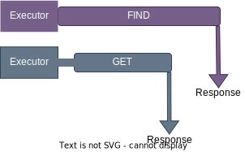

# Design

Fusion prioritises low latency for read queries.

 

To reduce blocking threads, the network operations and query execution are asynchronous and decoupled:

- The interface threads pass queries to the query engine, freeing the interface thread(s) to service other network operations
- When a query completes, the query engine passes the response to the interface, so the query engine thread can execute other queries

 

## Query Interfaces
There are three interfaces: one REST and two WebSockets:

- REST: for typical query payloads
- WebSocket Standard: for typical query payloads
- WebSocket Bulk: for larger payloads, intended for `STORE` with many objects

Each query has a dedicated buffer. The query is parsed as JSON and then as FQL. If these are successful then the query is passed to the query engine. This is an asychronous operation so the network interface thread can continue to serve requests/responses for any client.

When a query execution completes, the response is sent to the client on a network interface thread, allowing the query engine thread to execute other queries.

{: .important}
> There is no synchronisation between the REST and WebSocket interfaces. Queries are executed in the order received, which may not be in the same order as sent when sent to different interfaces.
>
> It is safe for a client to send queries to different interfaces but only if the order of execution is not important.

 

## Query: REST vs WebSockets
A REST query requires a new HTTP connection for each query, but a WebSocket only requires the connection is established once. This reduces latency but it requires Fusion and the OS to maintain the connection until the client dsiconnects.

Generally, if a client queries regularly then it is usually best to favour the WebSocket interface. The frequency of queries to consider 'regular' depends on network latency and hardware resources.

 

## Query Engine Overview
The query engine is what actually executes queries:

- A query executes on its own thread
- Queries are executed in isolation - no interthread communication is required
- Queries are executed in batches, grouped by the query access type (explained below)

A performance killer for multithreaded software are mutexes.

When multiple threads access the same memory location and just one _may_ write to that location, access by all threads must be protected, even if most of the threads  require only read access.  

 

## Query Access Type
Each query has a data access type:

- Read: the query reads from the cache, it does not mutate (`GET`, `FIND`, `COUNT`, etc)
- Write: the query may mutate the cache (`STORE`, `UPDATE`, `DELETE`, `CREATE_CLASS`, etc)

 

## Query Execution
To reduce data race issues, only one access type can execute at a given time:

- If a write query is executing, no other queries can execute
- If a read query is executing, only read queries can execute

 

### Write Queries
Write queries have a constraint: there can only be one write query executing.

This may seem a huge disadvantage, but there is an advantage: although there can only be one write query executing, it is _**the**_ only query, so no data race protection is required. 

{: .important}
> There is an opportunity to execute multiple write queries in certain circumstances: if write queries are writing to different and unrelated Fusion classes, they can run independently. This will be considered in the future.
>
>"Fusion classes" here refers to the classes you create in the cache, not classes in the Fusion code.

 

### Read Queries
These contraints benefit read queries:
- as a read query executes, there can't be data races because there are no write queries executing
- by definition a read query does not change data, so multiple read queries can execute concurrently without data races, therefore no data race protection is required

If there are no active write queries, a read query must only wait to execute if all threads are busy, otherwise it will always execute immediately and be completely independant from the other read queries: they are all read-only, no interthread communication required so no data races possible.

 

## Query Response Order
Write and read queries are executed in the order received but the response order differs.

### Write Queries
Responses are sent in the same order as received.

### Read Queries
Responses are sent immediately, even if there is a read query from the same client still executing that was received first.

For example, a client sends two queries:

- The client sends a `FIND`
- The client sends a `GET` 10 microseconds later
- The `FIND` execution takes 100 microseconds
- The `GET` execution takes 60 microseconds

 

Even though the `GET` was received after `FIND`, it completes before the `FIND`, therefore the client will receive the `GET_RSP` first.

 

## CPU Utilisation
A queue is used to ensure queries are executed in the correct order. Fusion assumes it will receive many queries so aims to pop the queries from the queue as soon as possible.

This process has two states:

### Poll
Repeatedly checks for queries to pop. The period is 1 second.

- When a query is popped, the polling period is extended by another 1 second
- If no queries are received during the polling period, enter the Wait state 

During the polling period one logical core is maxed.

### Wait
Wait until being notified that a query is in the queue.
 
Core usage reduces to near zero whilst waiting.

