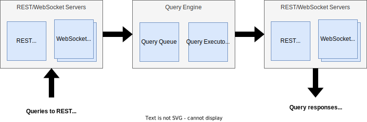

# Design

Fusion prioritises low latency for read queries and limiting configuration.

 

The network and query execution are asynchronous to decouple query execution from requests and responses. This avoids threads blocking:

- The interface threads pass queries to the query engine, freeing the interface thread to service other network requests
- When a query completes, the query engine passes the response to the interface, so the query engine thread can execute other queries

 

## Query Interfaces
There are two interface types: REST and WebSocket. There is one REST interface and two WebSocket interfaces:

- WebSocket Normal: for typical query payloads
- WebSocket Bulk: for larger payloads, intended for `STORE` with many objects

Each query has a dedicated buffer. The query is parsed as JSON and then as FQL. If these are successful then the query is passed to the query engine. This is an asychronous operation so the network interface thread can continue to serve requests/responses for any client.

When a query execution completes, the response is sent to the client on a separate thread, allowing the query engine thread execute other queries.

{: .important}
> There is no synchronisation between the REST and WebSocket interfaces. Queries are executed in the order received, which may not be in the same order as sent when to different interfaces.
>
> It is safe to send queries to different interfaces but only if the order of execution is not important.

 

## Query Engine Overview
The query engine is what actually executes queries:

- A query executes on its own thread
- Each query is completely separate - there is no interthread communication required
- When a read query finishes executing, the response is sent immediately, irrespective of the receive order (explanation further down)

A performance killer for multithreaded software are mutexes, used to protect mutable shared data between threads. A thread needs to read or write to a memory location whilst at least one other thread reads or writes to the same location.

If more than one thread can mutate the same memory location, then all threads that access that memory location must use protection, even if the majority of the threads only require read access.

 

## Query Access Type

Each query type has a data access level:

- Read: the query only reads from the cache, it does not mutate (`GET`, `FIND`, `COUNT`, etc)
- Write: the query mutates the cache (`STORE`, `UPDATE`, `DELETE`, `CREATE_CLASS`, etc)

 

## Query Execution
To reduce data race issues, only one access type can execute at a given time:

- If a write query is executing, no other queries can execute
- If a read query is executing, only read queries can execute

 

### Write Queries

There is one constraint for write queries: there can only be one write query executing.

This may seem a huge disadvantage, but there is an upside: although there can only be one write query executing, it is _**the**_ only query, so no data race protection is required. 

{: .important}
> There is an opportunity to execute multiple write queries in certain circumstances: if write queries are writing to different and unrelated Fusion classes, they can run independently. This will be considered in the future.
>
>"Fusion classes" here refers to the classes you create in the cache, not classes in the Fusion code.

 

### Read Queries

These contraints benefit read queries:
- as a read query executes, there can't be data races because there can't be write queries executing to change the cache
- by definition a read query doesn't change data, so multiple read queries can execute concurrently without data races, therefore no data race protection

If there are no active write queries, a read query must only wait to execute if all threads are busy, otherwise it will always execute immediately and be completely independant from the other read queries - they are all read-only, no interthread communication required so no data races possible.

 

## Query Response Order

### Write Queries
These gaurantees only apply when sending from the same client on the same query interface:

- Execution: in the order received
- Responses: sent in the same order as the write queries were received

 

### Read Queries

- Execution: in the order received
- Responses: no guarantees, responses are sent immediately when the query finishes

If a client sends a `FIND` and then a `GET`. A `GET` query involves less work so it'll likely complete first. So even though the `GET` was received second, the execution may complete first, therefore its response is sent first.

