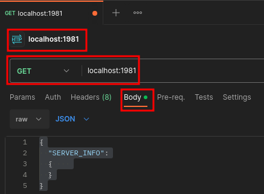
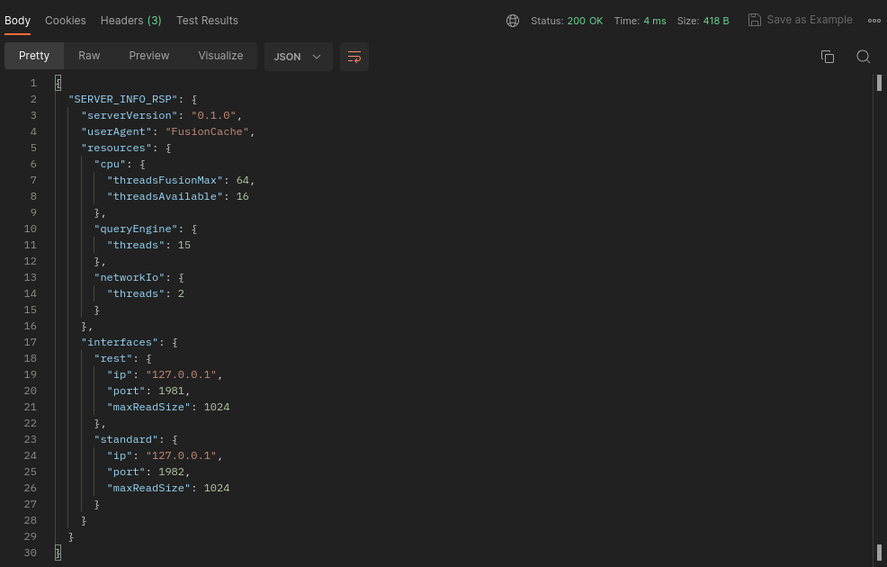
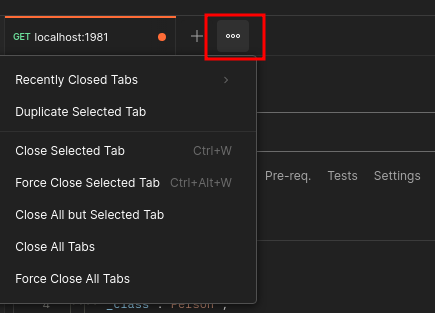

# Quick Start
This guide covers:

- Install
- Run
- Using [Postman](https://www.postman.com/)
- Store objects
- Query objects

The guide uses Postman to query the server, which provides a cross-platform UI to create HTTP clients, including WebSocket clients.

Postman is required from step 3, it can be downloaded from [here](https://www.postman.com/downloads/).

It also a good idea to read [Concepts](../../concepts.md) before continuing.

<br/>

# Install
Follow the [Install](../../install/install.md) instructions to download and install the Debian package.

<br/>

# Run
[Run](../../install/run.md) contains full instructions but for this guide we only need:

- Rest and WS Standard interfaces on localhost
- Default buffer sizes and ports

The default ports are 1981 and 1982.

If these ports are unavailable, you can change Fusion's ports with `--restQueryPort` or `--wsQueryPort`.

- Enter the install directory: `cd /usr/local/bin/fusioncache`
- Start: `./fusionserver --restQueryIp=127.0.0.1 --wsQueryIp=127.0.0.1`

The server will report similar to:

```console
Fusion v0.1.0 starting
Checking startup arguments
Registering signals
Available threads: 16
I/O Threads: 2
Normal: 1
Rest: 1
Starting WebSocket Normal server 127.0.0.1:1982
Starting Query Rest server on 127.0.0.1:1981
Started WebSocket Normal server on 127.0.0.1:1982
Started Query Rest server on 127.0.0.1:1981
Fusion ready
```
<br/>

# Query

## Server Info

- Open Postman and create a new HTTP `GET` request
- Ensure the request is `GET` and the address is `localhost:1981`
- Select `Body` tab, just under the address bar
- Inside `Body` tab, enter:

```json
{
  "SERVER_INFO":
  {    
  }
}
```
- Press Send and Fusion will return server information





<br/>


## Create Class

- In Postman, replace the `SERVER_INFO` query with the following and press Send:

```json
{
  "CREATE_CLASSES":
  {    
    "Address":
    {
      "city":"string"
    },
    "Person":
    {
      "forename":"string",
      "surname":"string",
      "address":"Address"
    }
  }
}
```

- This creates an `Address` and `Person` class. The `Person` class has an `address` member which is type `Address`
- The response is a `CREATE_CLASSES_RSP`. If there's an error, you'll receive `CREATE_CLASSES_RSP_ERR`

```json
{
  "CREATE_CLASSES_RSP":
  {
    "Address": {},
    "Person": {}
  }
}
```

<br/>

## Store Person and Address Objects

- Replace the `CREATE_CLASSES` query with:

```json
{
  "STORE":
  { 
    "_class":"Person",
    "_objects":
    [
      {
        "forename":"John",
        "surname":"Wick",
        "address":
        {
          "city":"New York"
        }
      }
    ]    
  }
}
```
- This creates two objects - a `Person` and an `Address` object
- The `STORE_RSP` contains the two OIDs (Object IDs) - your response will have different `_oid` values:

```json
{
  "STORE_RSP":
  [
    {
      "Person":
      {
        "address":
        {
          "Address":
          {
            "_oid": "6201f873-67c1-495b-a20a-23356b401635"
          }
        },
        "_oid": "a1eca163-7d2f-40d0-a6fc-ba717ba19930"
      }
    }
  ]
}
```

- Because `Person::address` is a class type (`Address`) a new object is created
- The OID for each object is returned:
  - Person: `a1eca163-7d2f-40d0-a6fc-ba717ba19930`
  - Address: `6201f873-67c1-495b-a20a-23356b401635`

<br/>

## Get Object
`STORE_RSP` returned the OIDs for the cached objects. When we know the OID for an object, we can use `GET` to retrieve the object from cache. 

We can reduce typing by using the "Duplicate Tab" feature in Postman. Click the three dots and click "Duplicate selected tab":



- In the new tab, select "Body"
- In the following query, you must set `_oids` value to the `Person::_oid` returned in the `STORE_RSP` above.

For this example, we do:

```json
{
  "GET":
  { 
    "Person":
    {
      "_oids":["ce614727-5ea3-449c-8b9d-62716f94d13c"]
    }
  }
}
```
- Press Send and the response will be as below but with different OIDs:

```json
{
  "GET_RSP":
  [
    {
      "forename": "John",
      "surname": "Wick",
      "address":
      {
        "Address":
        {
          "city": "New York",
          "_oid": "6201f873-67c1-495b-a20a-23356b401635"
        }
      },
      "_oid": "a1eca163-7d2f-40d0-a6fc-ba717ba19930"
    }
  ]
}
```

This shows how Fusion manages relationships between objects: the `Person` class contains the `address` member, and because it manages object relationships, it can return the appropriate `Address` object.

<br/>

## Store More Objects

- `_objects` is an array so we can cache multiple objects in a single query
- We'll store three more `Person` objects by replacing the first `STORE` with:

```json
{
  "STORE":
  { 
    "_class":"Person",
    "_objects":
    [
      {
        "forename":"James",
        "surname":"Bond",
        "address":
        {
          "city":"London"
        }
      },
      {
        "forename":"Jason",
        "surname":"Bourne",
        "address":
        {
          "city":"Paris"
        }
      },
      {
        "forename":"The",
        "surname":"Rock",
        "address":
        {
          "city":"Paris"
        }
      }
    ]
  }
}
```
- The response will show the OIDs for the three `Person` and three `Address` objects 

<br/>

## Find
The `STORE` queries stored Jason Bourne and The Rock's `Address::city` as Paris, let's confirm that by searching the cache with `FIND`.

- In the tab that contains the `GET` query, replace the query with:

```json
{
  "FIND":
  { 
    "Person":
    {
      "address":
      {
        "city":"Paris"
      }
    }
  }
}
```
- This says, "Return the `Person` objects with `Person::address::city` equal to "Paris"
- `FIND_RSP` has the `Person` objects for Jason Bourne and The Rock

```json
{
  "FIND_RSP": [
    {
      "Person": {
        "forename": "The",
        "surname": "Rock",
        "address": {
          "Address": {
            "city": "Paris",
            "_oid": "f2f16fac-4915-4cfa-9478-cde45ef4f083"
          }
        },
        "_oid": "2207bdd2-43f5-4a72-81a3-1a089f2fcb87"
      }
    },
    {
      "Person": {
        "forename": "Jason",
        "surname": "Bourne",
        "address": {
          "Address": {
            "city": "Paris",
            "_oid": "0efed7d3-7962-492c-9f40-00ba0ae5c6ca"
          }
        },
        "_oid": "292497b0-6c57-4ca9-b297-9c75cbbb58fc"
      }
    }
  ]
}
```


<br/>

## Update
The Rock moves to Moscow so we need to update his address. This is simple because the `Address` is a separate object so all we need is the OID for his `Address`.

The OID for The Rock's address was returned in `FIND_RSP` above so we can use `UPDATE` with the `Address` OID:

```json
{
  "UPDATE":
  {
    "Address":
    {
      "_oids":["f2f16fac-4915-4cfa-9478-cde45ef4f083"],
      "city":"Moscow"
    }
  }
}
```

- The root class is `Address` because we're updating an `Address` object
- We set `_oids` for the object to update. If we don't set this we'll update all Address objects (everyone will live in Moscow)

Let's confirm the update. We'll use `GET` on the `Person` object for The Rock:

```json
{
  "GET":
  { 
    "Person":
    {
      "_oids":["2207bdd2-43f5-4a72-81a3-1a089f2fcb87"]
    }
  }
}
```

With response:

```json
{
  "GET_RSP":
  {
    "_class":"Person",
    "_objects":
    [
      {
        "forename": "The",
        "surname": "Rock",
        "address":
        {
          "Address":
          {
            "city": "Moscow",
            "_oid": "f2f16fac-4915-4cfa-9478-cde45ef4f083"
          }
        },
        "_oid": "2207bdd2-43f5-4a72-81a3-1a089f2fcb87"
      }
    ]
  }
}
```
