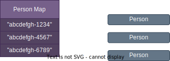
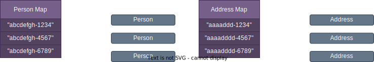

# Objects
An object in Fusion is the same as an object in all/most programming languages: it's an instance of a class. A class defines the structure and we create an object of that class to hold values.

Each object has an Object ID, also called an OID, which is a version 4 Universally Unique ID (UUID). 

An OID is created by Fusion when an object is stored and cannot be changed. It also not possible for users to supply an OID because Fusion must ensure they are unique.


## Structure
Rather than storing all objects in a single cache, they are grouped by their class. This means queries require the class name (known as the root class) - it needs to know which cache to access.


When an object is stored:

```json
{
  "STORE":
  {
    "_class":"Person",
    "_objects":
    [
      {
        "forename":"James",
        "surname":"Smith"
      }
    ]        
  }
}
```

An OID is generated for that object and a mapping from the OID to the object is created. If we have three `Person` objects it is visualised as (the OIDS are pseudo for clarity):





When you use `GET`:

```json
{
  "GET":
  {
    "Person":
    {
      "_oids":["abcdefgh-1234"]
    }
  }
}
```

This map is used to get the object. 

Similarly, if the `Person` class has an `address` member which is an `Address` type:

```json
{
  "STORE":
  {
    "_class":"Person",
    "_objects":
    [
      {
        "forename":"James",
        "surname":"Smith",
        "address":
        {
          "city":"Paris"
        }
      }
    ]        
  }
}
```

Two objects are created, one for `Person` and another for `Address`, and each has a unique OID and separate OID to object mappings:




<br/>

Fusion also stores the link between these `Person` and `Address` OIDs. This means when you retrieve the `Person` object, the `Address` can also be returned:

```json
{
  "GET":
  {
    "Person":
    {
      "_oids":["acbdefh-1234"]
    }
  }
}
```

```json
{
  "GET_RSP":
  {
    "_class":"Person",
    "_objects":
    [
      {
        "forename":"James",
        "surname":"Smith",
        "address":
        {
          "Address":
          {
            "city":"Paris"
          }          
        }
      }
    ]
  }
}
```

{: .important}
> Note 
>
> The `Person::address` contains the `city` in an `Address` object because of an intent to support inheritance. If a member is a base type, such as `Vehicle`, then the caller must be told type concrete type (`Car`, `Bus`, etc).

