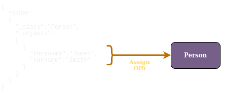
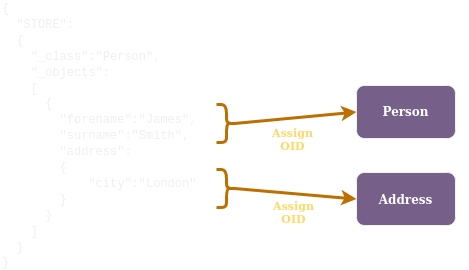

# Objects
An object in Fusion is the same as an object in all/most programming languages: it's an instance of a class. A class defines the structure and we create an object of that class to hold values.

Each object has an Object ID, also called an OID, which is a version 4 Universally Unique ID (UUID). 

An OID is created by Fusion when an object is stored and cannot be changed. It also not possible for users to supply an OID because Fusion must ensure they are unique.


## Structure
Rather than storing all objects in a single cache, they are grouped by their class. This means queries require the class name (known as the root class) - it needs to know which cache to access.


When an object is stored:

```json
{
  "STORE":
  {
    "_class":"Person",
    "_objects":
    [
      {
        "forename":"James",
        "surname":"Smith"
      }
    ]        
  }
}
```

An OID is generated for that object and a mapping from the OID to the object is created:





If the `Person` class has an `address` member which is an `Address` type:

```json
{
  "CREATE_CLASSES":
  {    
    "Address":
    {
      "city":"string"
    },
    "Person":
    {
      "forename":"string",
      "surname":"string",
      "address":"Address"
    }
  }
}
```

We can cache a `Person` with their `Address`:

```json
{
  "STORE":
  {
    "_class":"Person",
    "_objects":
    [
      {
        "forename":"James",
        "surname":"Smith",
        "address":
        {
          "city":"Paris"
        }
      }
    ]        
  }
}
```

Two objects are created, one for `Person` and another for `Address`. Each has a unique OID:

<br/>




<br/>

The response to the `STORE` query is a `STORE_RSP` which contains the OID for the `Person` and `Address` objects:

```json
{
  "STORE_RSP":
  [
    {
      "Person":
      {
        "address":
        {
          "Address":
          {
            "_oid": "82e1f914-845a-4ea5-9cfe-d3121f0a4444"
          }
        },
        "_oid": "363aa7c2-8ed9-4502-817e-74bc97b10cc8"
      }
    }
  ]
}
```

Fusion manages the relationship between the `Person` and `Address` OIDs, recording this `Person` OID has a link to that `Address` OID.

This means when you retrieve the `Person` object, the `Address` can also be returned.

Retrieve the `Person` object using the OID:
```json
{
  "GET":
  {
    "Person":
    {
      "_oids":["363aa7c2-8ed9-4502-817e-74bc97b10cc8"]
    }
  }
}
```

Response:
```json
{
  "GET_RSP":
  {
    "_class": "Person",
    "_objects":
    [
      {
        "forename": "James",
        "surname": "Smith",
        "address":
        {
          "Address":
          {
            "city": "Paris",
            "_oid": "82e1f914-845a-4ea5-9cfe-d3121f0a4444"
          }
        },
        "_oid": "363aa7c2-8ed9-4502-817e-74bc97b10cc8"
      }
    ]
  }
}
```
<br/>

OIDs are returned in the `STORE` response (`STORE_RSP`) and by [`FIND`](find/find.md).

<br/>

## Relationships
Creating separate objects allows Fusion to track the relationships and for objects to be retrieved, deleted and updated separately.

In the example above, the `Address` can be updated so the `city` is changed from "London" to "Paris" by using the `Address` OID:

```json
{
  "UPDATE":
  {
    "Address":
    {
      "_oids":["82e1f914-845a-4ea5-9cfe-d3121f0a4444"],
      "city":"Paris"
    }
  }
}
```

Now James Smith lives in Paris - because the updated `Address` OID is linked to the `Person` object for James Smith.