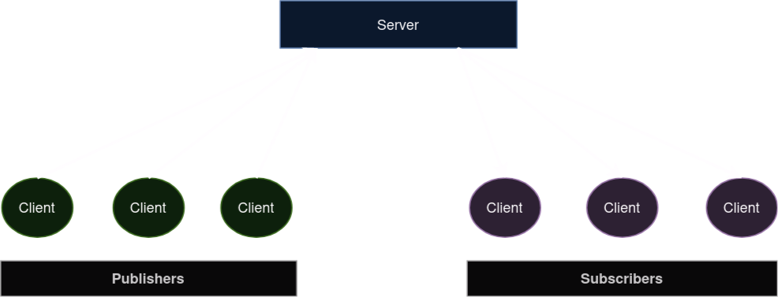

# Publish Subscribe
Publish subscribe is used to distribute messages from publishers to subscribers.

 

**Publisher**

A client that sends messages to the server.

**Subscriber**

A client that receives messages from the server that were published.

**Channel**

A channel is used to group related messages. A message is published to specific channel(s), whilst clients subscribe to particular channel(s). A channel is identified by a channel name. This is a simple method of ensuring that clients only receive messages that are relevant.
It is not possible to subscribe to channels using pattern matching but a client can subscribe to multiple channels.

 

## Notes
- Messages are not persisted in RAM or disk, so a client will only receive messages published whilst they are subscribed
- When a client disconnects it is unsubscribed from all subscribed channels

 
 

# Clients
Clients connect to the server via the WebSocket interface and use a few simple commands:

`SUB` - Subscribe to channel(s), optionally creating the channel(s) if required

`PUB` - Publish to one more channels, optionally creating the channel(s) if required

`UNSUB` - Unsubscribe from one or more channels

`CREATE_CHNL` - Creates a channel without subscribing or publishing

`DELETE_CHNL` - Deletes a channel

A client can act as a subscriber and publisher. A client can subscribe to a channel to which it publishes, although this makes little sense other than for testing.

